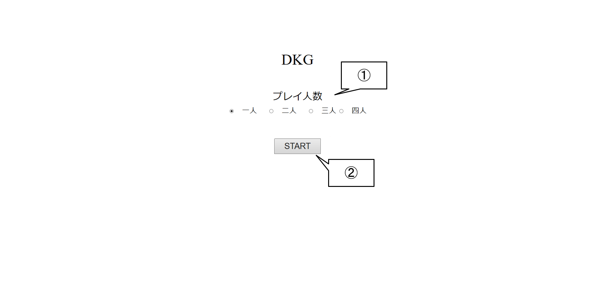
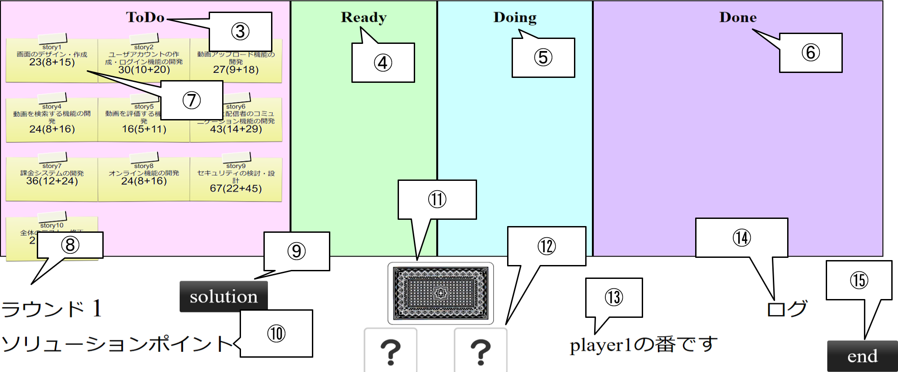

# デジタルカンバンゲーム「DKG」

## 準備

- 「<https://github.com/igakilab/sotuken_maeda>」に移動しClone or download をクリック，Download ZIP を選択してファイルをダウンロード．
- ダウンロードしたファイルを解凍，ファイルの中身の配置は変更しないこと．

## プレイの流れ

### ゲーム開始前

①参加人数選択
②STARTボタン
- start.htmlを実行してゲーム開始画面を開く（ブラウザはEdge推奨．Chromeでも動作確認済み）
- デイスプレイによって各要素の位置がずれるので，その場合はブラウザで画面サイズを変更
- 該当するプレイヤー人数のラジオボタンをクリックしチェックをつける（1～4人）
- STARTボタンをクリックするとゲーム開始
---
### ゲーム開始後

③ToDoのエリア（まだ手を付けていないストーリーを置いておく）  
④Readyのエリア（ストーリーのReadyで減らすべきタスクを減らすことができる）  
⑤Doingのエリア（ストーリーのDoingで減らすべきタスクを減らすことができる）  
⑥Doneのエリア（全てのタスクを減らし終わったストーリーを置いておく）  
⑦ストーリーカード（各エリアで減らすべきタスクが設定されている．左から合計，Ready，Doingで減らすべきタスクとなっている）  
⑧ラウンド数の表示（現在のラウンド数の表示）  
⑨Solutionボタン（クリックするとProblem解決モードになる）  
⑩Solution所持数（Solutionカードの所持数の表示）  
⑪チャンスカード（クリックするとチャンスカードを引くことができる）  
⑫サイコロ（クリックするとサイコロ振ることができる）
⑬手番プレイヤーの表示（手番プレイヤーの表示）  
⑭メッセージ表示場所（エラーメッセージなどを出力）  
⑮ENDボタン（クリックすると次のプレイヤーに手番が移る）  
- ストーリーカードをクリックするとテープの部分がプレイヤー番号に変わる．この状態をストーリーを選択している状態という．
- サイコロを振りストーリをクリックするとタスクを減らすことができる
- サイコロの出目だけタスクを減らすことができタスクを減らし終えると次のエリアに移動させる．しかし前のエリアのタスクが残っているのに次のエリアでタスクを減らすことはできない．
- Doingにあるストーリーのタスクを初めて減らすとテープの部分がプレイヤー番号とプレイヤーに応じた色に変わる．この状態を「担当」といい，「担当」のついたストーリーは担当者でないとタスクを減らそうとしたときにサイコロの出目を半分にするというデメリットが発生する．
- チャンスカードを引くことでゲームに様々なイベントが発生する．チャンスカードには3種類のカードがある
  - Eventカード（引くと即時発動．カードに書かれた処理を実行する．）
  - Problemカード（引くと即時発動．今選択されているストーリーに問題が発生する）
  - Solutionカード（引くと手元に置いておく．使用することでストーリーに発生している問題を）
- Problemカードを引くと今選択されているストーリーに問題が発生する．問題が発生したストーリーは問題が解決されるまでDoneに移動することができなくなる．
- 問題を解決するためにSolutionカードを用いる．Solutionカードを持っているプレイヤーが自分の手番時Solutionボタンを押して問題が発生しているストーリーをクリックすることで問題解決に挑むことができる．問題解決に挑むプレイヤーは他のプレイヤーに今発生している問題がどのようにすれば解決するかをプレゼンする．プレゼンした解決内容で問題が解決できると他のプレイヤーがすべて納得すれば問題は解決される．
### ゲームの流れ
以下の手順を1ターンとする．ターンが一周することを1ラウンドとする．
- 1.ストーリーを選択する
- 2.サイコロを振る
- 3.チャンスカードを引く（任意）
- 4.タスクの残り工数を減らす
- 5.Solutionカードを使用する（任意）
- 6.ターン終了

### 終了条件
- 12ラウンド終了する，もしくはすべてのストーリーカードのタスクを終了させてDoneに移動するとゲーム終了
